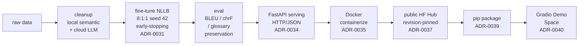

# LONGTU KOREA Inc. — Game Localization Translation Pipeline

[한국어](README.md) | [English](README.en.md) | [中文](README.zh-CN.md)


🔗 **[Live Demo — Hugging Face Space](https://huggingface.co/spaces/SimpleJerry/longtu-nllb-zh2ko-demo)**

This repository reproduces the game localization translation pipeline developed by the author during his tenure as a Systems Engineer at LONGTU KOREA Inc. (㈜룽투코리아; since renamed to STACO LINK Co., Ltd. / ㈜스타코링크). The company faced translation outsourcing costs of tens of millions of KRW per year for their Korean-market games; the goal was to fine-tune an NLLB model on the company's proprietary game corpus and automate a significant share of that workload with lightweight human proofreading. The original form was a collection of Jupyter Notebook files, gradually reconstructed using Claude Code and Codex into the reproducible pipeline you see today.

A zh-CN → ko translation pipeline built by fine-tuning `facebook/nllb-200-distilled-600M` on a proprietary game localization corpus — data cleaning → training → evaluation → FastAPI serving → Docker → public HF Hub → pip package → online Gradio demo, connected end-to-end.

## Results

**Current model.** `checkpoint-48000` from the early-stopping run, decoded with
beam search (`num_beams=4`). Held-out test split (seed 42, unseen during
training and checkpoint selection):

| Metric | Score |
| --- | --- |
| BLEU (whitespace) | 0.325 |
| chrF (max_n=6, β=2) | 0.590 |
| Glossary preservation (no-space) | 0.954 |
| Glossary preservation (exact) | 0.950 |

**Capability ladder** (same test split, beam=4 throughout):

| Stage | BLEU | chrF | Preservation (no-space) |
| --- | --- | --- | --- |
| Base NLLB-600M *(pre-fine-tuning baseline — no markers)* | 0.009 | 0.226 | 0.323 |
| Fine-tuned `checkpoint-48000`, beam=4 **(current model)** | **0.325** | **0.590** | **0.954** |


Net gain from fine-tuning + data cleaning: **+0.316 BLEU (~34×)** at the same
beam=4 decode; glossary preservation rises from ~32% to ~95%.

## Architecture

Full pipeline overview (left-to-right flow):



## Technical Background

**Terminology marker (`<start>...<end>`) method.** To preserve game-specific
terminology during translation, the pipeline uses source-side terminology
injection. Based on Dinu et al. (ACL 2019), *"Training Neural Machine
Translation to Apply Terminology Constraints"*: source-side glossary matches
are wrapped with special token pairs and the model is trained on data where the
target already contains the required term. The model learns a soft constraint —
reproducing glossary terms naturally from context — rather than having tokens
forcibly inserted at decode time (hard constrained decoding), which would risk
disrupting fluency. A single marker shape minimises tokenizer vocabulary
expansion.

**Evaluation metrics.** BLEU (Papineni et al., 2002) measures n-gram precision
and is the standard MT metric. Per Google Cloud Translate's
[BLEU score interpretation guide](https://docs.cloud.google.com/translate/docs/bleu-scores),
0.30–0.40 corresponds to "Understandable to good translations" — the current
model's 0.325 sits in this range. Korean's whitespace tokenisation can
underrepresent morpheme-level quality, so chrF (character n-gram F-score,
Popović 2015) is reported alongside. Glossary preservation directly checks
whether glossary terms appear in the translation; reporting both exact-match and
no-space variants separates true term omissions from harmless spacing
inconsistencies.

**Avoiding overfitting.**

1. **Early stopping** — a composite score (BLEU + chrF + glossary preservation)
   is monitored on the validation split; training halts when improvement stalls.
2. **Deterministic 8:1:1 data split** — fixed with seed 42; the test split is
   used exactly once for final reporting and never for checkpoint selection.
3. **Data quality gate** — only data passing the strict gate enters training.

## Usage

**Download the public model (HF Hub)**

```python
from transformers import AutoTokenizer, AutoModelForSeq2SeqLM

repo = "SimpleJerry/longtu-nllb-zh2ko"
tag  = "earlystop-v1-ckpt48000"  # always pin to a specific published tag

tokenizer = AutoTokenizer.from_pretrained(repo, revision=tag)
model     = AutoModelForSeq2SeqLM.from_pretrained(repo, revision=tag)
```

License: CC-BY-NC-4.0 (non-commercial use only).

**Serving** — endpoints: `POST /translate`, `GET /health`, `GET /info`.

```powershell
venv\Scripts\python.exe scripts\serve.py --dry-run   # validate config, no model load
venv\Scripts\python.exe scripts\serve.py             # load checkpoint, serve 127.0.0.1:8000
```

Contract: [ADR-0034](docs/decisions/adr/ADR-0034-serving-contract-synchronous-http-api.md).

**Docker deployment** — model weights are never baked into the image; pulled
automatically from the public HF Hub at startup (ADR-0038).

```bash
docker build -t longtu-translation-service:latest .

# No token required — pulls ~2.3 GB model from public HF Hub on first start
docker run -d \
    --gpus all \
    -p 8000:8000 \
    -v longtu_hf_cache:/home/appuser/.cache/huggingface \
    longtu-translation-service:latest
```

Contract: [ADR-0035](docs/decisions/adr/ADR-0035-docker-jenkins-deployment-contract.md).
For the local-volume variant (dev/offline), see `configs/serving/docker-localmount.json`.

**Library call**

```python
from longtu_translation_pipeline.inference import load_translator, translate_texts

# after: pip install -e .  or  pip install longtu-translation-pipeline
```

## Reproduction

```powershell
# 1. Install
python -m venv .venv && .\.venv\Scripts\Activate.ps1
pip install -r requirements.txt
pip install -r requirements-training.txt
pip install -e .

# 2. Data cleaning
venv\Scripts\python.exe scripts\segments_cleaning_pipeline.py --dry-run
venv\Scripts\python.exe scripts\segments_cleaning_pipeline.py --apply
venv\Scripts\python.exe scripts\segments_glossary_cross_cleaning_pipeline.py --strict-check

# 3. Training (earlystop.json: 8:1:1 split, seed 42, early-stopping)
venv\Scripts\python.exe scripts\train_model.py \
    --config configs\training\earlystop.json --train --run-name <run-name>

# 4. Evaluation
venv\Scripts\python.exe scripts\run_inference.py \
    --config configs\inference\default.json --generate-test --run-dir <run-dir>
venv\Scripts\python.exe scripts\evaluate_translation.py \
    --config configs\evaluation\generation_report.json --input <generated-csv>

# 5. Publish (see maintenance docs for full checklist)
```

Detailed cleaning rules: [docs/architecture/data-cleaning-pipeline.md](docs/architecture/data-cleaning-pipeline.md).  
Checkpoint republish workflow: [docs/maintenance/republish-checklist.md](docs/maintenance/republish-checklist.md).

## Licensing

| Component | License |
| --- | --- |
| Code (this repository) | [MIT](LICENSE) |
| Trained model weights | [CC-BY-NC-4.0](https://creativecommons.org/licenses/by-nc/4.0/) (inherited from NLLB, ADR-0037) |
| Training corpus | Proprietary — not distributed |

## Larger Models (1.3B / 3.3B)

NLLB-200 also ships larger bases — `nllb-200-1.3B` and `nllb-200-3.3B`.
We have **not** benchmarked 1.3B/3.3B on this project's fine-tuned zh-CN → ko
task, so no expected quality-gain figure is given.

| | 600M (current) | 1.3B | 3.3B |
| --- | --- | --- | --- |
| Parameters | ~0.6B | ~1.3B (~2.1×) | ~3.3B (~5.4×) |
| Inference latency (dense, ∝ params) | 1× | ~2.1× | ~5.4× |
| Full fine-tune VRAM (AdamW, mixed precision) | fits 16 GB (~14.9 GB measured) | ~21 GB — exceeds 16 GB | ~53 GB — far exceeds single 16 GB GPU |

## Reference Documents

- [Architecture decisions (ADR)](docs/decisions/adr/README.md)
- [Model card](docs/product/model-card.md)
- [Notebook inventory](docs/notebooks/inventory.md)
- [Agent constitution (CLAUDE.md)](CLAUDE.md)
- [Republish checklist (maintenance)](docs/maintenance/republish-checklist.md)
