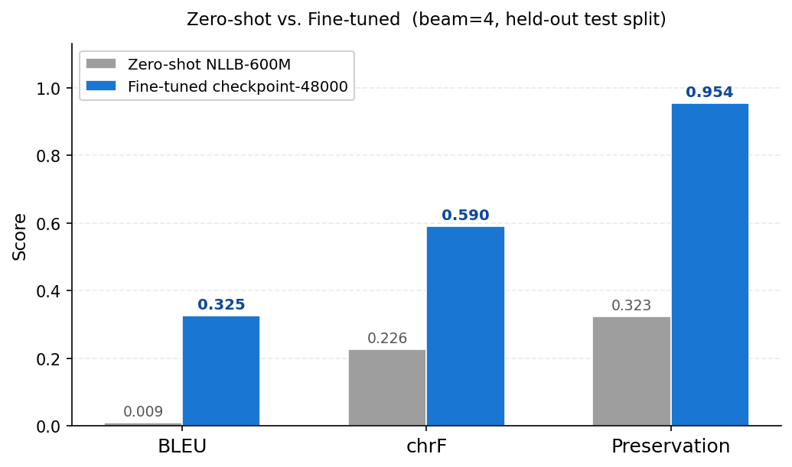
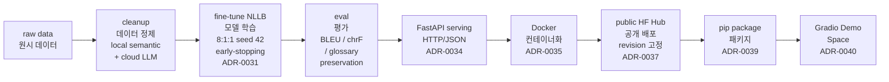

# ㈜룽투코리아 게임 현지화 번역 파이프라인

[한국어](README.md) | [English](README.en.md) | [中文](README.zh-CN.md)


🔗 **[Live Demo — Hugging Face Space](https://huggingface.co/spaces/SimpleJerry/longtu-nllb-zh2ko-demo)**

이 저장소는 저자가 ㈜룽투코리아(LONGTU KOREA Inc., 현 ㈜스타코링크 / STACO LINK Co., Ltd.) 시스템 엔지니어로 재직할 당시 수행한 게임 현지화 번역 파이프라인의 재현물입니다. ㈜룽투코리아는 자사 게임의 한국 서비스에서 매년 수천만 원에 달하는 번역 외주 비용이 발생하고 있었으며, 보유한 게임 코퍼스로 NLLB 모델을 파인튜닝하고 소량의 인간 검수를 보조로 삼아 번역을 자동화하는 것이 목표였습니다. 원래 형태는 일련의 Jupyter Notebook 파일이었으며, 이후 Claude Code와 Codex를 활용해 재현 가능한 파이프라인으로 재구성했습니다.

`facebook/nllb-200-distilled-600M`을 게임 현지화 코퍼스로 파인튜닝한 zh-CN → ko 번역 파이프라인으로, 데이터 정제 → 학습 → 평가 → FastAPI serving → Docker → 공개 HF Hub → pip 패키지 → 온라인 Gradio 데모까지 전 과정이 연결되어 있습니다.

## 결과

**현재 모델.** early-stopping run의 `checkpoint-48000`, beam search(`num_beams=4`) 디코딩.
held-out test split(seed 42, 학습 및 checkpoint 선택에서 미사용):

| 지표 | 점수 |
| --- | --- |
| BLEU (공백 단위) | 0.325 |
| chrF (max_n=6, β=2) | 0.590 |
| Glossary preservation (no-space) | 0.954 |
| Glossary preservation (exact) | 0.950 |

**능력 단계표** (동일한 test split, 전 단계 beam=4):

| 단계 | BLEU | chrF | Preservation (no-space) |
| --- | --- | --- | --- |
| Base NLLB-600M *(파인튜닝 전 기준선 — marker 없음)* | 0.009 | 0.226 | 0.323 |
| Fine-tuned `checkpoint-48000`, beam=4 **(현재 모델)** | **0.325** | **0.590** | **0.954** |



파인튜닝 + 데이터 정제의 순 효과: 동일한 beam=4 디코딩 기준 **+0.316 BLEU (~34×)**;
glossary preservation이 ~32%에서 ~95%로 상승했습니다.

## 아키텍처

전체 파이프라인 개요 (좌→우 흐름):



## 기술 배경

**용어 marker (`<start>...<end>`) 방법론.** 번역 시 게임 용어를 보존하기 위해 source 측 용어 주입(source-side terminology injection) 방식을 사용합니다. Dinu et al. (ACL 2019) *"Training Neural Machine Translation to Apply Terminology Constraints"*에 기반하며, source 중국어 텍스트에서 glossary와 매칭되는 부분을 `<start>...<end>` 특수 토큰 쌍으로 감싼 뒤 해당 형태로 학습시킵니다. 이를 통해 모델은 target 한국어에 해당 용어를 자연스럽게 재현하는 soft constraint를 학습합니다. decode 시점에 토큰을 강제 삽입하는 hard constrained decoding과 달리 번역 유창성을 유지하며, 단일 marker 형태를 채택해 tokenizer 확장을 최소화합니다.

**평가 지표.** BLEU(Papineni et al., 2002)는 n-gram 정밀도 기반 표준 MT 지표입니다. Google Cloud Translate의 [BLEU 해석 기준](https://docs.cloud.google.com/translate/docs/bleu-scores?hl=ko)에 따르면 0.30~0.40 범위는 "이해 가능~양호한 번역(Understandable to good translations)"에 해당하며, 본 모델의 0.325는 이 구간에 속합니다. 단, 형태소가 풍부한 한국어에서는 공백 단위 토큰화가 번역 품질을 과소평가할 수 있으므로 chrF(character n-gram F-score, Popović 2015)를 함께 보고합니다. Glossary preservation은 용어집 항목의 출현 여부를 직접 측정하며, exact match와 no-space match를 함께 보고해 띄어쓰기 불일치를 실제 용어 누락으로 오판하는 것을 방지합니다.

**과적합 방지.**

1. **Early stopping** — validation split에서 BLEU + chrF + glossary preservation 복합 점수를 관찰하며 개선이 없으면 학습을 조기 종료하고 최선 checkpoint를 자동 선택합니다.
2. **결정적 8:1:1 데이터 분할** — seed 42로 고정해 train/validation/test를 나누며, test split은 최종 보고에만 한 번 사용합니다.
3. **데이터 정제 품질 게이트** — strict gate를 통과한 corpus만 학습에 사용합니다.

## 사용

**공개 모델 다운로드 (HF Hub)**

```python
from transformers import AutoTokenizer, AutoModelForSeq2SeqLM

repo = "SimpleJerry/longtu-nllb-zh2ko"
tag  = "earlystop-v1-ckpt48000"  # revision을 고정하여 가져오기

tokenizer = AutoTokenizer.from_pretrained(repo, revision=tag)
model     = AutoModelForSeq2SeqLM.from_pretrained(repo, revision=tag)
```

라이선스: CC-BY-NC-4.0 (비상업적 사용만 허용).

**서빙(serving)** — 엔드포인트: `POST /translate`, `GET /health`, `GET /info`.

```powershell
venv\Scripts\python.exe scripts\serve.py --dry-run   # 설정만 검증, 모델 미로딩
venv\Scripts\python.exe scripts\serve.py             # 체크포인트 로딩, 127.0.0.1:8000 serve
```

계약: [ADR-0034](docs/decisions/adr/ADR-0034-serving-contract-synchronous-http-api.md).

**Docker 배포** — 모델 가중치는 이미지에 포함되지 않으며, 시작 시 공개 HF Hub에서 자동 다운로드됩니다(ADR-0038).

```bash
docker build -t longtu-translation-service:latest .

# 토큰 불필요 — 시작 시 공개 HF Hub에서 ~2.3 GB 모델 자동 다운로드
docker run -d \
    --gpus all \
    -p 8000:8000 \
    -v longtu_hf_cache:/home/appuser/.cache/huggingface \
    longtu-translation-service:latest
```

계약: [ADR-0035](docs/decisions/adr/ADR-0035-docker-jenkins-deployment-contract.md). 로컬 볼륨 변형은 `configs/serving/docker-localmount.json` 참고.

**라이브러리 호출**

```python
from longtu_translation_pipeline.inference import load_translator, translate_texts

# pip install -e . 또는 pip install longtu-translation-pipeline 이후
```

## 복현

```powershell
# 1. 설치
python -m venv .venv && .\.venv\Scripts\Activate.ps1
pip install -r requirements.txt
pip install -r requirements-training.txt
pip install -e .

# 2. 데이터 정제
venv\Scripts\python.exe scripts\segments_cleaning_pipeline.py --dry-run
venv\Scripts\python.exe scripts\segments_cleaning_pipeline.py --apply
venv\Scripts\python.exe scripts\segments_glossary_cross_cleaning_pipeline.py --strict-check

# 3. 학습 (earlystop.json: 8:1:1 split, seed 42, early-stopping)
venv\Scripts\python.exe scripts\train_model.py \
    --config configs\training\earlystop.json --train --run-name <run-name>

# 4. 평가
venv\Scripts\python.exe scripts\run_inference.py \
    --config configs\inference\default.json --generate-test --run-dir <run-dir>
venv\Scripts\python.exe scripts\evaluate_translation.py \
    --config configs\evaluation\generation_report.json --input <generated-csv>

# 5. 발행 (새 checkpoint 배포 체크리스트는 유지보수 문서 참고)
```

상세 정제 규칙: [docs/architecture/data-cleaning-pipeline.md](docs/architecture/data-cleaning-pipeline.md).
체크포인트 재배포 워크플로: [docs/maintenance/republish-checklist.md](docs/maintenance/republish-checklist.md).

## 라이선스

| 구성 요소 | 라이선스 |
| --- | --- |
| 코드 (이 저장소) | [MIT](LICENSE) |
| 학습된 모델 가중치 | [CC-BY-NC-4.0](https://creativecommons.org/licenses/by-nc/4.0/) (NLLB 기반, ADR-0037) |
| 학습 코퍼스 | 회사 전용 — 미배포 |

## 더 큰 모델 (1.3B / 3.3B)

NLLB-200에는 더 큰 베이스(`nllb-200-1.3B`, `nllb-200-3.3B`)도 있습니다.
본 프로젝트의 파인튜닝된 zh-CN → ko 작업에서 1.3B/3.3B를 **벤치마크하지 않았으므로** 예상 품질 향상 수치는 제시하지 않습니다.

| | 600M (현재) | 1.3B | 3.3B |
| --- | --- | --- | --- |
| 파라미터 | ~0.6B | ~1.3B (~2.1×) | ~3.3B (~5.4×) |
| 추론 지연 (dense, 파라미터에 비례) | 1× | ~2.1× | ~5.4× |
| 전체 파인튜닝 VRAM (AdamW, mixed precision) | 16 GB에 적합 (~14.9 GB 실측) | ~21 GB — 16 GB 초과 | ~53 GB — 단일 16 GB GPU 초과 |

## 참고 문서

- [아키텍처 결정 기록 (ADR)](docs/decisions/adr/README.md)
- [모델 카드](docs/product/model-card.md)
- [Notebook inventory](docs/notebooks/inventory.md)
- [에이전트 헌법 (CLAUDE.md)](CLAUDE.md)
- [재배포 체크리스트 (유지보수)](docs/maintenance/republish-checklist.md)
