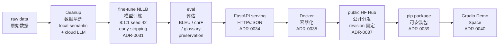

# 龙图韩国游戏本地化翻译管道

[한국어](README.md) | [English](README.en.md) | [中文](README.zh-CN.md)


🔗 **[在线演示 — Hugging Face Space](https://huggingface.co/spaces/SimpleJerry/longtu-nllb-zh2ko-demo)**

本仓库是作者在㈜룽투코리아（LONGTU KOREA Inc.，龙图韩国，现更名为 STACO LINK Co., Ltd. / ㈜스타코링크）担任系统工程师期间所从事的游戏本地化翻译管道工作的复现。龙图韩国每年的翻译外包费用高达数千万韩元，本项目的目标是基于公司掌握的游戏语料对 NLLB 模型进行微调，辅以少量人工校对，从而实现翻译自动化，节省翻译成本。原始形态是一批 Jupyter Notebook 文件，此后通过 Claude Code 与 Codex 逐步重构为现在这个可复现的管道。

基于 `facebook/nllb-200-distilled-600M` 在游戏本地化语料上微调的 zh-CN → ko 翻译管道，全链路打通：数据清洗 → 训练 → 评估 → FastAPI serving → Docker → 公开 HF Hub → pip 包 → 在线 Gradio demo。

## 成果

**当前模型。** early-stopping run 的 `checkpoint-48000`，beam search（`num_beams=4`）解码。
held-out test split（seed 42，训练和 checkpoint 选择中均未见过）：

| 指标 | 分数 |
| --- | --- |
| BLEU（空格分词） | 0.325 |
| chrF (max_n=6, β=2) | 0.590 |
| Glossary preservation (no-space) | 0.954 |
| Glossary preservation (exact) | 0.950 |

**能力阶梯**（相同 test split，全程 beam=4 解码）：

| 阶段 | BLEU | chrF | Preservation (no-space) |
| --- | --- | --- | --- |
| Base NLLB-600M *（微调前基线 —— 无 marker）* | 0.009 | 0.226 | 0.323 |
| Fine-tuned `checkpoint-48000`，beam=4 **（当前模型）** | **0.325** | **0.590** | **0.954** |


微调 + 数据清洗带来的净增益：同档 beam=4 解码下 **+0.316 BLEU（~34×）**；
glossary preservation 从 ~32% 升至 ~95%。

## 架构

完整 pipeline 概览（从左到右）：



## 技术背景

**术语 marker（`<start>...<end>`）方法论。** 为在翻译中保留游戏专有术语，管道采用源端术语注入（source-side terminology injection）方案。该方案基于 Dinu et al.（ACL 2019）*"Training Neural Machine Translation to Apply Terminology Constraints"*：在源中文文本中，将与 glossary 匹配的部分用 `<start>...<end>` 特殊 token 对包裹，并以此形式进行训练。模型通过上下文学习到软约束，能在目标韩文中自然复现对应术语，不损伤翻译流畅度。采用单一 marker 形式是为了将 tokenizer 词表扩展控制在最小范围。

**评估指标。** BLEU（Papineni et al., 2002）是基于 n-gram 精确率的标准 MT 指标。根据 Google Cloud Translate 的 [BLEU 分数解读指南](https://docs.cloud.google.com/translate/docs/bleu-scores?hl=zh-cn)，0.30~0.40 区间对应"可理解到良好的翻译"，本模型的 0.325 属于该区间。对于形态丰富的韩语，空格级分词会低估实际翻译质量，因此同时报告 chrF（字符级 n-gram F-score，Popović 2015）作为补充指标。Glossary preservation 直接检测译文中是否出现术语表条目，同时报告精确匹配（exact）和去空格匹配（no-space），以区分真正的术语遗漏与无害的空格差异。

**过拟合防控。**

1. **Early stopping** —— 在 validation split 上监测 BLEU + chrF + glossary preservation 复合分数，无改善时提前终止训练并自动选出最优 checkpoint。
2. **确定性 8:1:1 数据划分** —— 以 seed 42 固定，test split 仅用于最终报告，不参与 checkpoint 选择，防止信息泄漏。
3. **数据质量门禁** —— 只有通过 strict gate 的语料才进入训练。

## 使用

**下载公开模型（HF Hub）**

```python
from transformers import AutoTokenizer, AutoModelForSeq2SeqLM

repo = "SimpleJerry/longtu-nllb-zh2ko"
tag  = "earlystop-v1-ckpt48000"  # 始终通过 revision=<tag> 固定拉取

tokenizer = AutoTokenizer.from_pretrained(repo, revision=tag)
model     = AutoModelForSeq2SeqLM.from_pretrained(repo, revision=tag)
```

License: CC-BY-NC-4.0（非商业使用）。

**服务（serving）** —— 端点：`POST /translate`、`GET /health`、`GET /info`。

```powershell
venv\Scripts\python.exe scripts\serve.py --dry-run   # 仅校验配置，不加载模型
venv\Scripts\python.exe scripts\serve.py             # 加载检查点，serve 127.0.0.1:8000
```

契约：[ADR-0034](docs/decisions/adr/ADR-0034-serving-contract-synchronous-http-api.md)。

**Docker 部署** —— 模型权重不烘焙进镜像，启动时从公开 HF Hub 自动拉取（ADR-0038）。

```bash
docker build -t longtu-translation-service:latest .

# 无需 token —— 首次启动自动从公开 HF Hub 拉取 ~2.3 GB 模型
docker run -d \
    --gpus all \
    -p 8000:8000 \
    -v longtu_hf_cache:/home/appuser/.cache/huggingface \
    longtu-translation-service:latest
```

契约：[ADR-0035](docs/decisions/adr/ADR-0035-docker-jenkins-deployment-contract.md)。本地挂载变体见 `configs/serving/docker-localmount.json`。

**库调用**

```python
from longtu_translation_pipeline.inference import load_translator, translate_texts

# pip install -e .  或  pip install longtu-translation-pipeline 后可直接导入
```

## 复现

```powershell
# 1. 安装
python -m venv .venv && .\.venv\Scripts\Activate.ps1
pip install -r requirements.txt
pip install -r requirements-training.txt
pip install -e .

# 2. 数据清洗
venv\Scripts\python.exe scripts\segments_cleaning_pipeline.py --dry-run
venv\Scripts\python.exe scripts\segments_cleaning_pipeline.py --apply
venv\Scripts\python.exe scripts\segments_glossary_cross_cleaning_pipeline.py --strict-check

# 3. 训练（earlystop.json：8:1:1 划分，seed 42，early-stopping）
venv\Scripts\python.exe scripts\train_model.py \
    --config configs\training\earlystop.json --train --run-name <run-name>

# 4. 评估
venv\Scripts\python.exe scripts\run_inference.py \
    --config configs\inference\default.json --generate-test --run-dir <run-dir>
venv\Scripts\python.exe scripts\evaluate_translation.py \
    --config configs\evaluation\generation_report.json --input <generated-csv>

# 5. 发布（完整发布流程见维护文档）
```

详细清洗规则：[docs/architecture/data-cleaning-pipeline.md](docs/architecture/data-cleaning-pipeline.md)。  
Checkpoint 重新发布工作流：[docs/maintenance/republish-checklist.md](docs/maintenance/republish-checklist.md)。

## 许可证

| 组件 | 许可证 |
| --- | --- |
| 代码（本仓库） | [MIT](LICENSE) |
| 训练模型权重 | [CC-BY-NC-4.0](https://creativecommons.org/licenses/by-nc/4.0/)（继承 NLLB，ADR-0037） |
| 训练语料 | 公司专有 —— 不分发 |

## 更大的模型 (1.3B / 3.3B)

NLLB-200 还提供更大的基座（`nllb-200-1.3B`、`nllb-200-3.3B`）。
本项目**没有**在微调后的 zh-CN → ko 任务上基准测试过 1.3B/3.3B，因此不给出预期质量提升数字。

| | 600M（当前） | 1.3B | 3.3B |
| --- | --- | --- | --- |
| 参数量 | ~0.6B | ~1.3B (~2.1×) | ~3.3B (~5.4×) |
| 推理延迟（dense，与参数量成正比） | 1× | ~2.1× | ~5.4× |
| 全量微调显存（AdamW，混合精度） | 适配 16 GB（~14.9 GB 实测） | ~21 GB —— 超过 16 GB | ~53 GB —— 远超单张 16 GB GPU |

## 参考文档

- [架构决策记录 (ADR)](docs/decisions/adr/README.md)
- [模型卡片](docs/product/model-card.md)
- [Notebook inventory](docs/notebooks/inventory.md)
- [Agent 宪法 (CLAUDE.md)](CLAUDE.md)
- [重新发布检查清单（维护）](docs/maintenance/republish-checklist.md)
